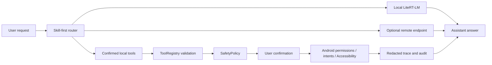

# Solin Android

[](https://github.com/William-zgx/solin-android/actions/workflows/android.yml)
[](LICENSE)
[](https://developer.android.com)
[](#current-status)

<p align="center">
  English | <a href="README.zh-CN.md">简体中文</a>
</p>

<p align="center">
  
</p>

Solin Android (app name `栖知 Solin`) is an experimental, privacy-first Android
assistant. Local LiteRT-LM Text+Vision chat, an optional OpenAI-compatible remote
endpoint, and confirmed phone-side tools (reminders, sharing, app navigation,
screen text, OCR, contacts, calendar, low-risk app search).

## Table Of Contents

- [Product Contract](#product-contract)
- [Implementation Highlights](#implementation-highlights)
- [First Screen And Trust Flow](#first-screen-and-trust-flow)
- [Phone Control Scope](#phone-control-scope)
- [Current Status](#current-status)
- [Quick Start](#quick-start)
- [Configuration And Secrets](#configuration-and-secrets)
- [Recommended Models](#recommended-models)
- [Validation](#validation)
- [Documentation](#documentation)
- [Contributing](#contributing)
- [Security](#security)
- [License](#license)

## Product Contract

- **Local by default**: chat history, memory, private tool results, screen
  text, OCR, local images, and attachment excerpts stay on device as `LocalOnly`
  unless the user chooses a remote path.
- **Remote is optional**: remote chat works only after an endpoint is configured
  and remote mode selected. Images, suspected sensitive text, and configured
  remote sends require preview or confirmation.
- **Actions are confirmed**: device actions are validated locally and stay behind
  permission, disclosure, confirmation, audit, and fail-closed boundaries;
  high-risk device actions still require confirmation.
- **Users stay in control**: keys can be cleared, conversations and memories
  deleted, and privacy-sensitive behavior is documented before release.



## Implementation Highlights

- LiteRT-LM local chat with GPU/CPU fallback and explicit model loading.
- Local memory indexing; semantic recall is available only after a runtime probe.
- Bounded local image input for verified local chat models; unsupported models
  fail closed instead of silently OCRing or uploading.
- OpenAI-compatible remote chat with local filtering of `LocalOnly` context.
- Registry-driven tools, built-in Skills, local safety policy, redacted trace,
  and audit records.
- Model-driven app search bootstraps from a verified local Chat/action-planning
  model and falls back to the static Skill path when local planning is unavailable.
- **Remote-vision GUI automation (opt-in)**: with the Trust-Center toggle on,
  Remote mode, and a vision-capable model, Solin captures the screen via
  `AccessibilityService.takeScreenshot` (no MediaProjection, no new foreground
  service), sends it to the remote vision model, and applies the returned tap
  coordinate as a local `ui_tap` that still passes every device-control preflight
  and confirmation. Screen-pixel egress is gated by an in-app
  first-confirm-then-auto rule and a per-send audit; capture or send failures
  fail closed and stop the loop.
- The chat surface only shows a safe result summary; structured tool fields stay
  available through the trace/audit surfaces, not a typed chat card.

## First Screen And Trust Flow

Solin opens into the assistant surface. On first run, the user chooses remote
setup, recommended local model download, trusted model import, or model
management. Local setup, remote sends, attachments, voice, memory, and tool
execution remain visible user choices.

Scripted regression and manual acceptance must be recorded separately. Voice
input, the Android system document picker, foreground prompts, and the
MediaProjection consent sheet are system-mediated flows and need real device
acceptance.

## Phone Control Scope

Phone control is limited to low-risk navigation and search: observe, tap, type,
submit search, scroll, swipe, long-press, system keys (home/recents/enter/delete),
back, and wait. Swipe, long-press, and system-key presses require confirmation
and count toward the 5-step checkpoint; system keys are a fixed whitelist, never
an arbitrary keycode. Sending, deleting, paying, ordering, publishing, sensitive
input, and permission changes stay on the confirmation path.

After a confirmed app launch with a follow-up intent, Solin can continue inside
the opened app under the same 5-step checkpoint, gated by a locally-installed
mobile-action model and an expected-package foreground guard. It fails closed to
open-then-stop if the model is absent or the target app is not foreground, and
the continuation stays LocalOnly.

The optional remote-vision path replaces the local action model for the in-app
continuation: a vision-capable remote model sees the screen capture and returns a
tap coordinate, executed as a local `ui_tap` under the same confirmation,
preflight, and 5-step checkpoint rules. Off by default; requires the Trust-Center
"Remote-vision GUI automation" toggle, Remote inference mode, and a model that
supports image input. See `docs/privacy_notice.md` for the egress consent and
audit model.

## Current Status

Suitable for local development, personal evaluation, and controlled tester
builds. Not ready for broad app-store or production distribution.

- The repository contains source code, tests, scripts, documentation, and small
  project assets.
- The repository does not contain model weights, API keys, keystores, signing
  passwords, user data, or generated release artifacts.
- Recommended model downloads are third-party artifacts; their upstream licenses,
  access rules, and redistribution terms must be reviewed separately.
- Bundled-model packages are internal lab artifacts until model license,
  redistribution, attribution, and notice approvals are complete.

## Quick Start

Requirements: JDK 17+, Android SDK 36 (target SDK 36, min API 28), and a physical
arm64-v8a Android device for realistic LiteRT-LM validation.

```bash
git clone https://github.com/William-zgx/solin-android.git
cd solin-android
export ANDROID_HOME=/path/to/android-sdk
export ANDROID_SDK_ROOT="$ANDROID_HOME"
./gradlew :app:assembleDebug
adb install -r app/build/outputs/apk/debug/app-debug.apk
```

After launch, choose one start path: configure an OpenAI-compatible remote
endpoint, download the recommended local E2B model, or import a trusted
`.litertlm` model.

## Configuration And Secrets

Solin works without committed secrets. Configure remote endpoints in the app or
use environment variables for local validation.

| Variable | Used by | Notes |
| --- | --- | --- |
| `ANDROID_HOME` / `ANDROID_SDK_ROOT` | Gradle and scripts | Android SDK location. |
| `ANDROID_SERIAL` | Device scripts | Select one authorized phone or emulator. |
| `SOLIN_HF_TOKEN` | Bundled-model build | Download credential for gated Hugging Face artifacts; not license approval. |
| `SOLIN_LIVE_REMOTE_BASE_URL` | Remote debug helper | Redacted in reports. |
| `SOLIN_LIVE_REMOTE_MODEL` | Remote debug helper | Redacted in reports. |
| `SOLIN_LIVE_REMOTE_API_KEY` | Remote debug helper | Must never be committed or recorded. |
| `RELEASE_KEYSTORE` and related signing variables | Signing scripts | Use only from a private signing environment. |

Run a local secret scan before committing sensitive changes:

```bash
scripts/privacy_scan.sh --report build/verification/privacy-scan.properties README.md README.zh-CN.md docs app/src/main scripts
```

If a token or signing secret lands in Git history, treat it as compromised,
revoke it first, then clean the history and rotate dependent credentials.

## Recommended Models

Recommended model metadata is pinned in `docs/model_manifest.md`. Downloads are
registered only after size and SHA-256 verification.

| Capability | Artifact | Approximate size | Purpose |
| --- | --- | ---: | --- |
| Basic chat E2B | `.litertlm` chat model | 2.59 GB | Default local Text+Vision chat path |
| Local memory | EmbeddingGemma `.tflite` + tokenizer | 184 MB | Semantic memory index after runtime probe |
| Device action | `.litertlm` action model | 284 MB | Bounded action planning with rule fallback |
| High-quality chat E4B | `.litertlm` chat model | 3.66 GB | Higher quality local Text+Vision chat option |

Model files are not committed to Git. Ordinary public release artifacts do not
bundle model files. The internal `bundledModels` package is the documented
exception for quick experience and lab validation; see
`docs/bundled_model_package.md`.

## Validation

```bash
# Local verification
scripts/doctor.sh
scripts/verify_local.sh

# Device or emulator verification
scripts/doctor.sh --device
ANDROID_SERIAL=<device-or-emulator> scripts/install_and_test_device.sh

# Full emulator regression (stricter artifact gate)
AVD_NAME=focus_agent_api36_arm64 scripts/regression_emulator.sh
```

Record emulator regression as passed only when `regression-emulator.properties`
contains `status=passed`.

Model-driven app-search evals are debug/device checks. Enable them with
`RUN_MODEL_DRIVEN_APP_SEARCH_EVAL=1`; mock and real app modes validate results
through `verifySearchQuery`, `expectedPackageName`, and `expectedAppName`, and
require `searchVerificationStatus=verified`.

Use `docs/phone_acceptance.md` for flows that need real device behavior or must
preserve downloaded models, remote configuration, sessions, or manual acceptance
state.

## Documentation

- Simplified Chinese README: `README.zh-CN.md`
- Architecture and module ownership: `docs/agent_core_modules.md`
- Privacy boundary: `docs/privacy_notice.md`
- Model provenance: `docs/model_manifest.md`
- Bundled-model lab package: `docs/bundled_model_package.md`
- Device/manual acceptance: `docs/phone_acceptance.md`
- Release readiness: `docs/release_readiness.md`
- Documentation index: `docs/index.md`

## Contributing

Contributions are welcome. Useful changes include a focused problem statement,
scoped code or documentation updates, tests or validation notes, and safe logs
or screenshots for device-specific issues.

Before opening a pull request, run `scripts/verify_local.sh`. For device-flow
changes, also follow `docs/phone_acceptance.md`. New tools, Skills, model paths,
and phone-control behavior need schema validation, privacy classification,
confirmation policy, audit coverage, and tests.

Good first areas: documentation corrections, tests around tool schemas and
safety policy, replay fixtures for low-risk app search and screen-observation
regressions, and UI accessibility fixes that preserve existing `testTag` values.

## Security

Do not open public issues that include secrets, private endpoints, personal
data, sensitive screenshots, unpublished signing details, or
redistribution-restricted model files.

Preferred disclosure flow:

1. Reproduce the issue without exposing private payloads.
2. Capture the smallest safe logs, stack traces, or validation reports.
3. Contact the repository owner privately before publishing details.
4. Include affected commit, Android version, device or emulator type, and the
   affected area.

Security-sensitive fixes should keep the default fail-closed behavior and add a
regression test where practical.

## License

Solin Android app code is distributed under the MIT License. Recommended model
downloads are third-party artifacts governed by their upstream licenses; see
`docs/model_manifest.md` and `docs/model_license_review.json`.
